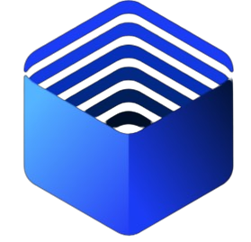

# AI SaaS - Web Block Elements for React/Next.js Projects

AI SaaS offers a collection of beautifully designed UI web block elements for Next.js projects, including navbars, hero sections, CTAs, features, sections, dashboard pages, components, forms, and more. These blocks are responsive, support dark mode, and can be easily browsed, copied, and pasted into projects.

## Key Features

- **Responsive and Dark Mode Support**
- **Variety of UI Web Block Elements**
- **Easy to Browse and Integrate**

## Built With

- **Next.js 14**
- **Typescript**
- **Tailwind CSS**
- **Shadcn UI**
